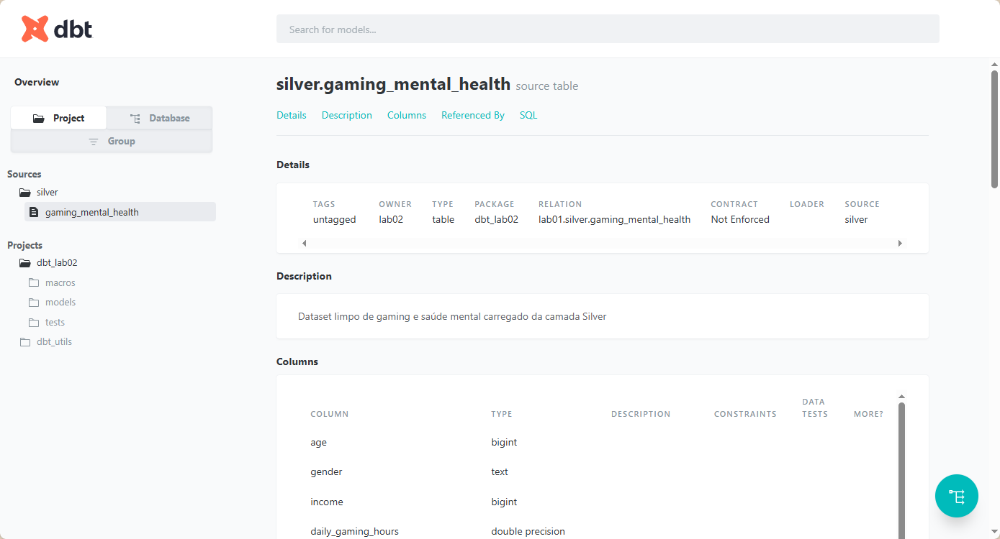
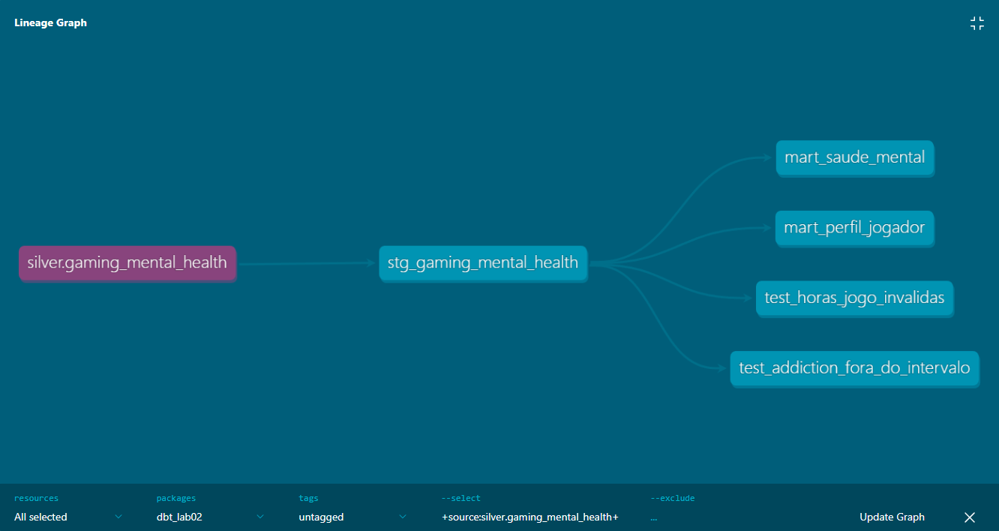
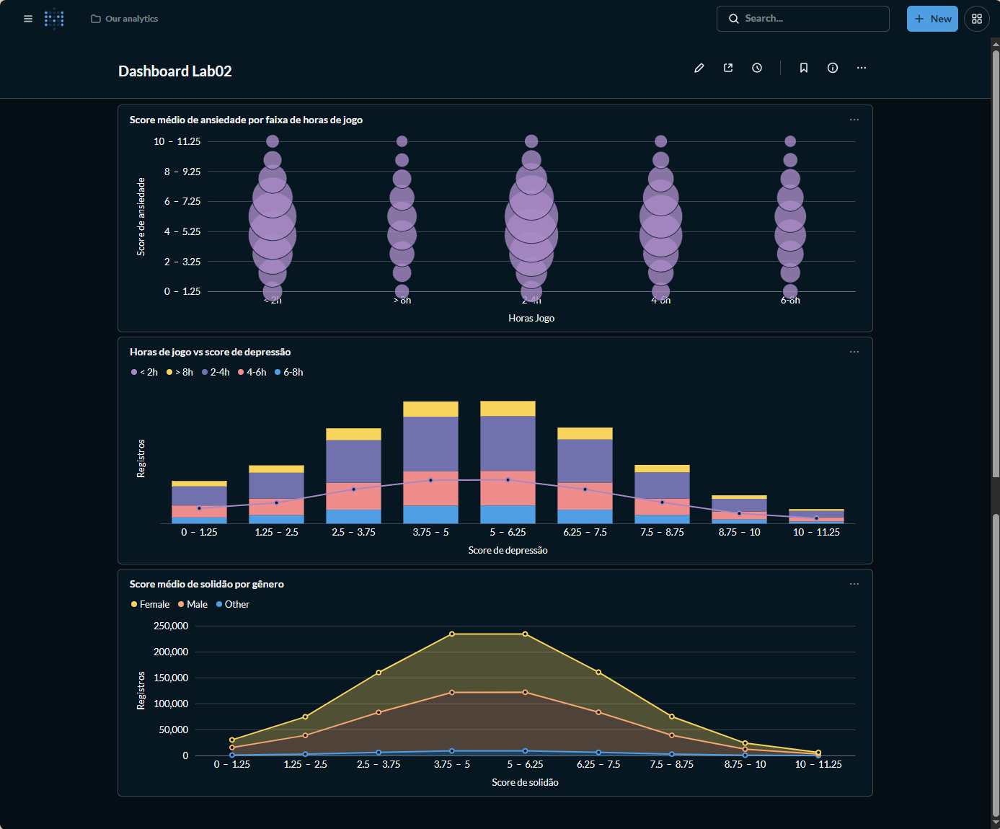

# Lab02 — Transformação de Dados com DBT

**Aluno:** João Armandes Vieira Costa  
**Disciplina:** Engenharia de Dados — Pós-Graduação  
**Dataset:** Gaming and Mental Health — 1.000.000 linhas × 39 colunas

---

## O que é o DBT?

O DBT (Data Build Tool) é uma ferramenta que permite transformar dados **dentro do banco de dados** usando SQL organizado em arquivos versionados. Em vez de escrever scripts Python para mover dados entre tabelas, o DBT cuida de toda a orquestração — ele resolve automaticamente a ordem de execução, executa testes de qualidade e gera documentação com lineage (grafo de dependências) sem nenhuma configuração extra.

A analogia mais simples: o DBT é um "makefile para SQL". Você define as transformações em arquivos `.sql` e ele executa tudo na ordem certa.

### Como o DBT se encaixa neste projeto

Nos laboratórios anteriores, a transformação Silver → Gold era feita por um script Python (`carga.py`). Neste laboratório, o DBT assume esse papel — ele lê os dados do schema `silver` no PostgreSQL e escreve as tabelas transformadas no schema `gold`.

```
Silver (Parquet) → Postgres schema silver → DBT → Postgres schema gold → Metabase
```

---

## Arquitetura Completa

```
CSV Original
     ↓
Bronze — ingestão as-is (data/raw/)
     ↓
Silver — limpeza e padronização (data/silver/dataset_clean.parquet)
     ↓
carregar_silver.py — carrega o Parquet no Postgres
     ↓
Postgres schema silver (tabela gaming_mental_health)
     ↓
DBT staging — padroniza e gera surrogate key
     ↓
DBT marts — transforma em tabelas analíticas
     ↓
Postgres schema gold (mart_saude_mental, mart_perfil_jogador)
     ↓
Metabase — dashboard com 3 visualizações
```

| Camada | Objetivo | Saída |
|--------|----------|-------|
| Bronze | Ingestão as-is | `data/raw/` + log |
| Silver | Limpeza e padronização | `data/silver/*.parquet` |
| Postgres Silver | Fonte para o DBT | schema `silver` no banco `lab01` |
| DBT Staging | Padronização e surrogate key | view `stg_gaming_mental_health` |
| DBT Marts | Tabelas analíticas | `mart_saude_mental`, `mart_perfil_jogador` |
| BI | Dashboard | Metabase em `localhost:3000` |

---

## Estrutura do Projeto

```
Lab02_NUSP/
├── data/
│   ├── raw/                             # CSV original + log de ingestão
│   └── silver/
│       ├── dataset_clean.parquet        # Dataset limpo
│       └── graficos/                    # Gráficos exploratórios
├── dbt_lab02/
│   ├── models/
│   │   ├── staging/
│   │   │   ├── sources.yml              # Declara a fonte Silver
│   │   │   ├── stg_gaming_mental_health.sql
│   │   │   └── stg_gaming_mental_health.yml
│   │   └── marts/
│   │       ├── mart_saude_mental.sql
│   │       ├── mart_perfil_jogador.sql
│   │       └── marts.yml
│   ├── macros/
│   │   └── classificar_horas_jogo.sql   # Macro de classificação
│   ├── tests/
│   │   ├── test_horas_jogo_invalidas.sql
│   │   └── test_addiction_fora_do_intervalo.sql
│   ├── packages.yml                     # Dependências do DBT
│   └── dbt_project.yml                  # Configuração do projeto
├── docs/
│   ├── print1.png                       # Documentação DBT
│   ├── print2.png                       # Lineage DBT
│   └── print3.png                       # Dashboard Metabase
├── carregar_silver.py                   # Carrega Parquet no Postgres
├── docker-compose.yml                   # Metabase + Postgres
├── requirements.txt
└── README.md
```

---

## Pré-requisitos

- Python 3.11+
- PostgreSQL 18 instalado localmente
- Docker instalado
- DBT instalado (`pip install dbt-postgres`)

---

## Como Reproduzir o Ambiente

### 1. Clonar o repositório

```bash
git clone https://github.com/Armandes/Lab02_NUSP.git
cd Lab02_NUSP
```

### 2. Instalar dependências Python

```bash
pip install -r requirements.txt
```

### 3. Criar o usuário no PostgreSQL

Abre o DBeaver ou psql e roda:

```sql
CREATE USER lab02 WITH PASSWORD 'lab02';
GRANT ALL PRIVILEGES ON DATABASE lab01 TO lab02;
```

### 4. Carregar o Parquet no schema silver

```bash
python carregar_silver.py
```

Isso cria a tabela `silver.gaming_mental_health` no PostgreSQL — é a fonte que o DBT vai ler.

### 5. Instalar dependências do DBT

```bash
cd dbt_lab02
dbt deps
```

O comando `dbt deps` instala os pacotes declarados no `packages.yml`, incluindo o `dbt_utils` usado para gerar surrogate keys.

### 6. Validar a conexão com o banco

```bash
dbt debug
```

Deve retornar `All checks passed!` confirmando que o DBT consegue conectar no PostgreSQL.

### 7. Executar os models

```bash
dbt run
```

O DBT vai executar os models na ordem correta:
1. `stg_gaming_mental_health` — staging
2. `mart_saude_mental` — mart de saúde mental
3. `mart_perfil_jogador` — mart de perfil do jogador

### 8. Executar os testes

```bash
dbt test
```

### 9. Gerar e visualizar a documentação

```bash
dbt docs generate
dbt docs serve
```

Acessa em: `http://localhost:8080`

---

## DBT — Explicação Detalhada

### Sources

O arquivo `models/staging/sources.yml` declara de onde o DBT vai ler os dados:

```yaml
sources:
  - name: silver
    schema: silver
    tables:
      - name: gaming_mental_health
```

Isso permite referenciar a tabela no SQL como `{{ source('silver', 'gaming_mental_health') }}` em vez de escrever o caminho completo — se o schema mudar, você altera só no `sources.yml`.

### Models

Os models são arquivos `.sql` que definem transformações. Cada model vira uma tabela ou view no banco.

**Staging** — camada de padronização:

`stg_gaming_mental_health.sql` lê da Silver, gera uma surrogate key única por jogador usando `dbt_utils.generate_surrogate_key` e organiza as colunas em grupos semânticos (perfil, hábitos, comportamento, social, saúde mental).

**Marts** — camada analítica (Gold):

`mart_saude_mental.sql` usa a macro `classificar_horas_jogo` para criar a coluna `faixa_horas_jogo` e agrupa as métricas de saúde mental para análise.

`mart_perfil_jogador.sql` consolida o perfil demográfico e hábitos dos jogadores para segmentação.

### Macro

A macro `classificar_horas_jogo` é uma função reutilizável escrita em Jinja+SQL:

```sql

    case
        when {{ coluna }} < 2  then '< 2h'
        when {{ coluna }} < 4  then '2-4h'
        when {{ coluna }} < 6  then '4-6h'
        when {{ coluna }} < 8  then '6-8h'
        else '> 8h'
    end

```

Para usar em qualquer model basta chamar `{{ classificar_horas_jogo('daily_gaming_hours') }}` — evita repetir o mesmo CASE WHEN em múltiplos lugares.

### Testes

**Genéricos** — definidos no YAML, validam automaticamente:

| Teste | Coluna | Descrição |
|-------|--------|-----------|
| `unique` | `player_id` | Garante que não há jogadores duplicados |
| `not_null` | `player_id`, `gender`, `anxiety_score`, `depression_score` | Garante que colunas essenciais não têm nulos |
| `accepted_values` | `gender` | Garante que só existem valores `Male`, `Female`, `Other` |

**Singulares** — queries SQL que buscam exceções de regras de negócio:

| Arquivo | Regra | Resultado |
|---------|-------|-----------|
| `test_horas_jogo_invalidas.sql` | Nenhum jogador pode ter mais de 24h de jogo diárias | 54 registros inválidos encontrados |
| `test_addiction_fora_do_intervalo.sql` | `addiction_level` deve estar entre 0 e 10 | Passou |

O teste de horas inválidas falhou intencionalmente — é um problema de qualidade real no dataset identificado também no Lab01-B pelo Great Expectations.

---

## Documentação DBT

### Tela principal



### Lineage graph

O lineage mostra as dependências entre os models — de onde cada tabela vem e para onde vai.



---

## Dashboard — Metabase

### Como subir o Metabase

```bash
docker-compose up -d
```

Acessa em: `http://localhost:3000`

### Configuração da conexão

| Campo | Valor |
|-------|-------|
| Host | host.docker.internal |
| Port | 5432 |
| Database | lab01 |
| Username | lab02 |
| Password | lab02 |

### Visualizações criadas

1. Score médio de ansiedade por faixa de horas de jogo
2. Horas de jogo vs score de depressão
3. Score médio de solidão por gênero



---

## Qualidade dos Dados

| Problema | Identificado por | Ação |
|----------|-----------------|------|
| 54 jogadores com `daily_gaming_hours` > 24h | Teste singular DBT | Documentado — dado inconsistente mantido para rastreabilidade |

---

## Dificuldades Encontradas

- Surrogate key com poucas colunas gerava duplicatas — resolvido adicionando mais colunas à chave
- PATH do DBT não configurado automaticamente no Windows — resolvido manualmente
- Macro criada na pasta `models/` em vez de `macros/` — movida corretamente
- Porta 5432 em conflito entre Postgres local e container Docker — resolvido mapeando container para porta 5433